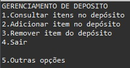
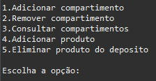
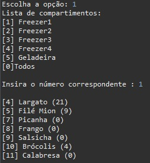
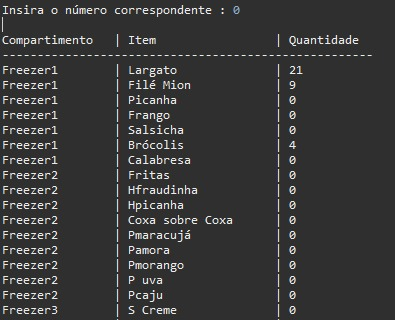
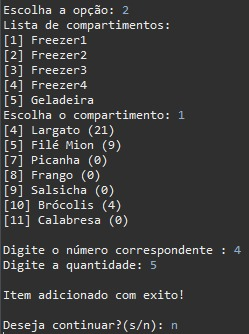
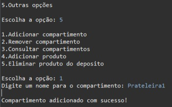
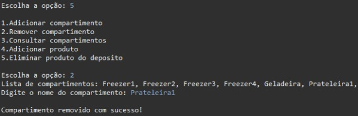
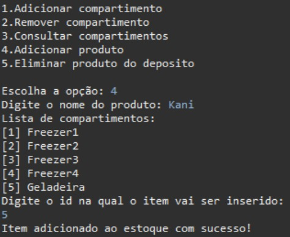
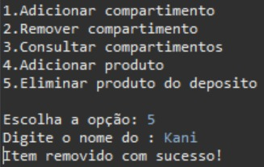
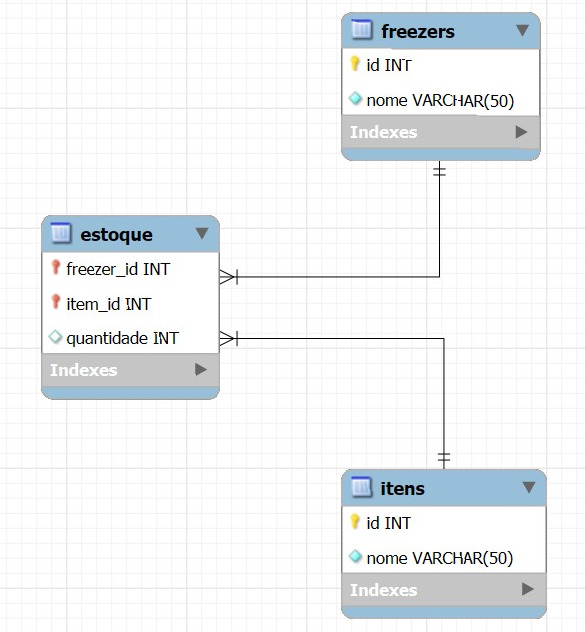

# Inventory Management System

**System in operation**

First and second system menus

  

View Itens

  

Add or remove product

**Menu 2**

Add compartment

Remove compartiment

Add product

Remove product

**Entity-Relationship Diagram**

**Technologies used**

-Eclipse IDE (Java,POO)

-mySQL(SQL)
